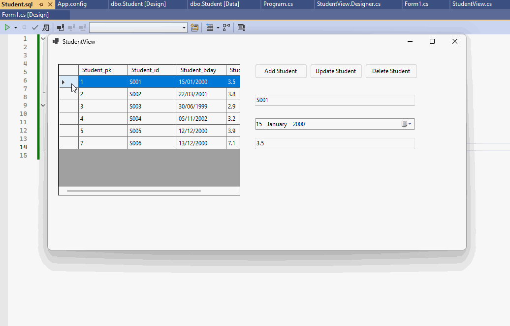

# Csharp CRUD First Demonstration Using Windows Forms and TSQL

This guided project is a simple CRUD (Create, Read, Update, Delete) application built with C# Windows Forms to manage student records. Users can add new students, update their details, delete records, and view all students in a data grid.

The application connects to a SQL Server database using ADO.NET, where it stores student information like ID, birthday, and GPA. It uses a model-view structure, with the StudentMV class handling data and the StudentModel representing each student.

This demonstration is a great starting point for learning how to create desktop applications that work with databases in C#.



### Steps

1. Set Up the Project:
  - [ ] Create a new Windows Forms application in Visual Studio.
  - [ ] Add references to necessary libraries (like ```using Microsoft.Data.SqlClient```).
2. Design the User Interface:
  - [ ] Use the Windows Forms Designer to add controls:
    - [ ] DataGridView for displaying student records.
    - [ ] TextBoxes for entering student ID and GPA.
    - [ ] DateTimePicker for selecting the student’s birthday.
    - [ ] Buttons for adding, updating, and deleting records.
3. Create the Database:
    - [ ] Use SQL Server Management Studio to create a new database.
    - [ ] Define a table for students with columns for ID, birthday, and GPA.
4. Configure Database Connection:
    - [ ] Add a connection string to the App.config file to connect to your SQL Server database.
5. Implement the Student Model:
    - [ ] Create a StudentModel class to represent student data (ID, birthday, GPA).
6. Build the Model-View Class:
    - [ ] Create a StudentMV class that includes methods for:
      - [ ] Loading students from the database.
      - [ ] Adding new students.
      - [ ] Updating existing records.
      - [ ] Deleting students.
7. Connect the UI with Logic:
    - [ ] In the StudentView class, write event handlers for button clicks to call the methods from StudentMV.
    - [ ] Implement selection change handling in the DataGridView to populate the input fields when a student is selected.
8. Test the Application:
    - [ ] Run the application to ensure all CRUD operations work correctly.
    - [ ] Check that data is displayed properly in the DataGridView and that updates reflect in the database.
